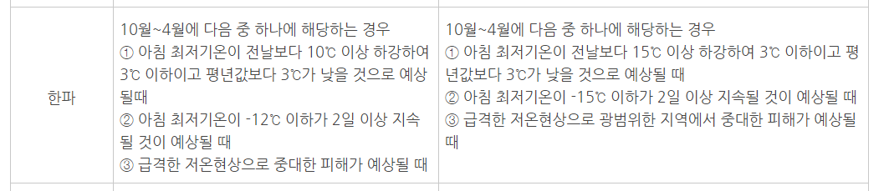
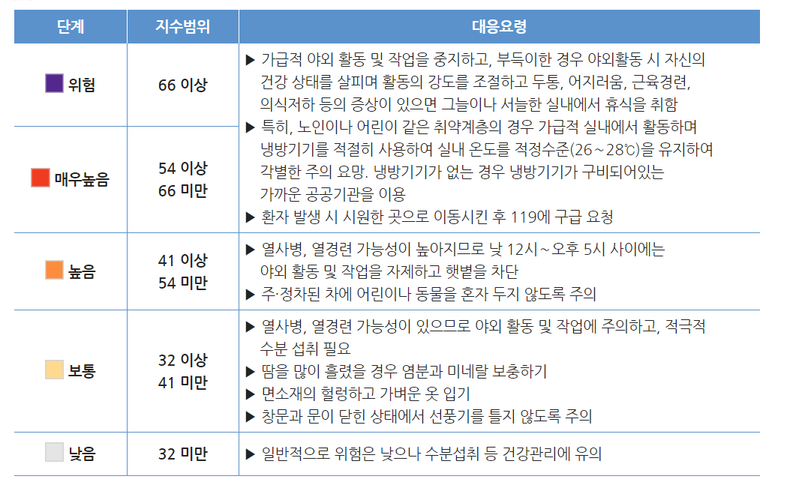
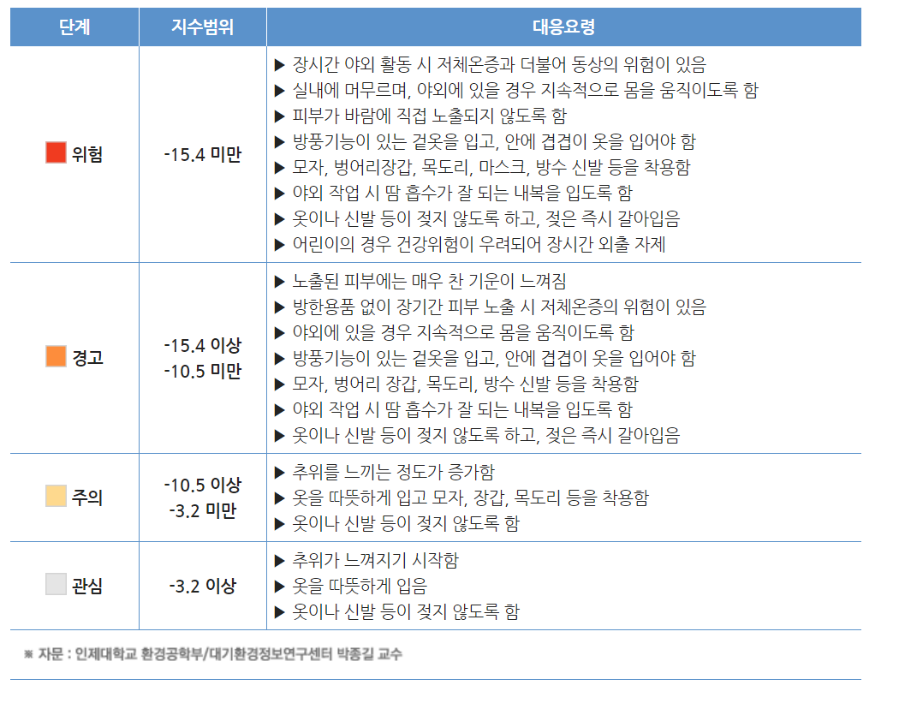

# 가설 설정

## 개요

여름이 더울수록 그 해 겨울이 추울 것이다.

여름이 더워질수록 그 해 겨울이 추워진다는 속설이 있다. 본 프로젝트를 통해 속설이 맞는지 확인해보려 한다.
(기사 링크 삽입)

## 분석 방법

서울시의 여름과  기상 데이터를 독립변수로, 겨울의 기온데이터를 종속변수로 설정하고 회귀분석 등을 이용해 가설이 맞는지 검증한다. 이 때 어떤 변수값이 겨울의 기온에 영향을 가장 많이 미치는 지를 알아낸다.

## 활용 데이터

[기상청 기상자료개방포털](http://data.kma.go.kr)

# 데이터 수집 
 
## 서울시 데이터로 한정

우리나라는 지형이 복잡하여 분석 범위를 전국으로 설정 했을 시 지리적 위치에 따라 기온의 편차가 크게 달라질 수 있다. 따라서 분석 범위를 서울시로 한정한다. 

## 30개년 데이터 추출

여름은 12개월 중 평균기온이 가장 높았던 3달, 겨울은 12개월 중 평균기온이 가장 낮았던 3달로 정의하여 기상 데이터를 수집한다. 중심극한정리에 따라 데이터의 정규성을 확보하기 위해 1989년 여름부터 2018년 겨울까지 최근 30개년의 데이터를 표본으로 준비한다.


# 데이터 분석


```{r setup }
knitr::opts_chunk$set(warning=FALSE, message=FALSE)
```


---

## 데이터 정제  
### 데이터 불러오기

```{r}
# 라이브러리 불러오기
library(tidyverse)
# 전체 데이터 불러오기
data <- read.csv("./data/seoulsi.csv")
```

### 여름철 데이터 만들기

```{r}
# 6,7,8월만 추출하기
library(DT)
jja <- data.frame()
for (i in seq(1989, 2018, 1)) {
  june <- data[grep(paste0(i, ".06"),data$기간),]
  july <- data[grep(paste0(i, ".07"),data$기간),]
  august <- data[grep(paste0(i, ".08"),data$기간),]
  jja <- rbind(jja, june, july, august)
}
jja <- jja[,-c(2)]
colnames(jja) <- c("연도","평균기온","평균최고기온","극점최고기온",
                   "평균최저기온","극점최저기온","강수량",
                   "평균습도","최소습도","평균해면기압",
                   "이슬점온도","평균운량","일조시간",
                   "평균풍속","최대풍속")
# 변수 수치화(reshape)
jja$강수량 <- as.numeric(jja$강수량)
jja$이슬점온도 <- as.numeric(jja$이슬점온도)
# 데이터 요약하기
summer_df <- jja %>%
  group_by(substr(연도,1,4)) %>% 
  summarise(여름평균기온=round(mean(평균기온),digit=3),
                여름평균최고기온=round(mean(평균최고기온),digit=3),
                여름극점최고기온평균=round(mean(극점최고기온),digit=3),
                여름극점최고기온=round(max(극점최고기온),digit=3),
                여름평균최저기온=round(mean(평균최저기온),digit=3),
                여름극점최저기온평균=round(mean(극점최저기온),digit=3),
                여름극점최저기온=round(min(극점최저기온),digit=3),
                여름강수량=round(mean(강수량),digit=3),
                여름평균습도=round(mean(평균습도),digit=3),
                여름최소습도=round(mean(최소습도),digit=3),
                여름평균해면기압=round(mean(평균해면기압),digit=3),
                여름이슬점온도=round(mean(이슬점온도),digit=3),
                여름평균운량=round(mean(평균운량),digit=3),
                여름일조시간=round(mean(일조시간),digit=3),
                여름평균풍속=round(mean(평균풍속),digit=3),
                여름최대풍속=round(mean(최대풍속),digit=3))

names(summer_df)[names(summer_df) == "substr(연도, 1, 4)"] <- c('year')
# 열지수 데이터 만들기
heatdata <- read.csv("./data/dataheatindex.csv")
heat_df <- heatdata %>% 
  group_by(year) %>% 
  summarise(열지수=round(mean(heatindex),digit=3),
               최대열지수=max(heatindex))
# 변수 합치고 확인하기
summer <- cbind(summer_df,heat_df[2:3])
datatable(summer, 
          caption = "여름철 기상데이터", 
          filter="top")

```

### 겨울철 데이터 만들기

```{r}
djf <- data.frame()
for (i in seq(1989, 2019, 1)) {
  december <- data[grep(paste0(i, ".12"),data$기간),]
  january <- data[grep(paste0(i+1, ".01"),data$기간),]
  febrary <- data[grep(paste0(i+1, ".02"),data$기간),]
  group <- rbind(december,january,febrary)
  djf <- rbind(djf,group)
}
year <- data.frame(rep(1989:2018, each=3),stringsAsFactors = FALSE)
djf <- cbind(djf,year)
djf <- djf[,-c(2)]

colnames(djf) <- c("연도","평균기온","평균최고기온","극점최고기온",
                   "평균최저기온","극점최저기온","강수량",
                   "평균습도","최소습도","평균해면기압",
                   "이슬점온도","평균운량","일조시간",
                   "평균풍속","최대풍속","year")
# 데이터 요약하기
winter_df <- djf %>%
  group_by(year) %>% 
  summarise(겨울평균기온=round(mean(평균기온),3),
                  겨울평균최고기온=round(mean(평균최고기온),3),
                  겨울극점최고기온평균=round(mean(극점최고기온),3),
                  겨울극점최고기온=round(max(극점최고기온),3),
                  겨울평균최저기온=round(mean(평균최저기온),3),
                  겨울극점최저기온평균=round(mean(극점최저기온),3),
                  겨울극점최저기온=round(min(극점최저기온),3))
winter <- winter_df                 
datatable(winter, 
          caption = "겨울철 기상데이터", 
          filter="top")
```

### 여름철과 겨울철 데이터 합치기

```{r}
winter$year <- as.character(winter$year)
summer_winter_df <- left_join(summer,winter)
datatable(summer_winter_df, 
          caption = "여름철-겨울철 기상데이터", 
          filter="top")
```

### 데이터 표준정규화(with scale)

앞서 만든 데이터를 정규화하기 위해 scale() 함수를 사용한다.

```{r}
scale_df <- as.data.frame(scale(summer_winter_df[2:26]))
```

###  데이터 나누기

독립변수(여름철 기상데이터)와 종속변수(겨울철 기온데이터)의 비교분석을 위해 데이터를 나누었다.

```{r} 
# 7개로 나누기
summer_winter_average <- scale_df[,-c(20:25)] 
# 겨울 평균기온과 비교(19)
summer_winter_average_max <- scale_df[,-c(19,21:25)] 
# 겨울 평균최고기온과 비교(20)
summer_winter_average_pole_max <- scale_df[,-c(19:20,22:25)]
# 겨울 극점최고기온평균과 비교(21)
summer_winter_pole_max <- scale_df[,-c(19:21,23:25)] 
# 겨울 극점최고기온과 비교(22)
summer_winter_average_min <- scale_df[,-c(19:22,24:25)] 
# 겨울 평균최저기온과 비교(23)
summer_winter_average_pole_min <- scale_df[,-c(19:23,25)] 
# 겨울 극점최저기온평균과 비교(24)
summer_winter_pole_min <- scale_df[,-c(19:24)] 
# 겨울 극점최저기온과 비교(25)
```

### 데이터 구조확인 {.tabset}
#### structure
```{r}
str(summer_winter_average)
```
```{r}
str(summer_winter_average_max)
```
```{r}
str(summer_winter_average_pole_max)
```
```{r}
str(summer_winter_pole_max)
```
```{r}
str(summer_winter_average_min)
```
```{r}
str(summer_winter_average_pole_min)
```
```{r}
str(summer_winter_pole_min)
```

#### summary
```{r}
summary(summer_winter_average)
```
```{r}
summary(summer_winter_average_max)
```
```{r}
summary(summer_winter_average_pole_max)
```
```{r}
summary(summer_winter_pole_max)
```
```{r}
summary(summer_winter_average_min)
```
```{r}
summary(summer_winter_average_pole_min)
```
```{r}
summary(summer_winter_pole_min)
```

---

## 1차 분석 {.tabset .tabset-pills}

여름이 더우면 겨울이 실제로 추웠는지 최근 30개년의 평균기온을 비교한다. 

```{r}
library(hrbrthemes)
```

### 여름-겨울 평균기온 비교 

여름과 겨울 평균기온의 상관관계를 분석한 결과 상관계수는 0.2xx가 나왔으며, 산점도는 아래와 같이 나왔다. (그래프)
<br>
```{r}
#여름평균기온
avg_summer_average <- (sum(as.numeric(summer$여름평균기온))/30)
summer %>%
  ggplot(aes(x=year, y=여름평균기온, group=1)) +
  geom_line(color="red") +
  geom_point(shape=24, color="black", fill="red", size=5) +
  theme_ipsum() +
  geom_hline(yintercept = avg_summer_average, linetype = 2, color = "grey35", size = 1) +
  labs(title = "서울시 여름(6월-8월) 평균기온",
       subtitle = "1998 - 2018",
       x = "연도", 
       y = "기온") + theme(axis.text.x = element_text(angle = 90, hjust = 1, vjust = 0.5 ))

#겨울평균기온
avg_winter_average <- (sum(as.numeric(winter_df$겨울평균기온))/30)
winter_df %>%
  ggplot(aes(x=year, y=겨울평균기온, group=1)) +
  geom_line(color="blue") +
  geom_point(shape=25, color="black", fill="blue", size=5) +
  theme_ipsum() +
  geom_hline(yintercept = avg_winter_average, linetype = 2, color = "grey35", size = 1) +
  labs(title = "서울시 겨울(12월-2월) 평균기온",
       subtitle = "1998 - 2018",
       x = "연도", 
       y = "기온") + theme(axis.text.x = element_text(angle = 90, hjust = 1, vjust = 0.5 ))
```

### 여름-겨울 평균최고기온 비교
```{r}
avg_summer_average_max <- (sum(as.numeric(summer$여름평균최고기온))/30)
summer %>%
  ggplot(aes(x=year, y=여름평균최고기온, group=1)) +
  geom_line(color="red") +
  geom_point(shape=24, color="black", fill="red", size=5) +
  theme_ipsum() +
  geom_hline(yintercept = avg_summer_average_max, linetype = 2, color = "grey35", size = 1) +
  labs(title = "서울시 여름(6월-8월) 평균최고기온",
       subtitle = "1998 - 2018",
       x = "연도", 
       y = "기온") + theme(axis.text.x = element_text(angle = 90, hjust = 1, vjust = 0.5 ))

#겨울평균최고기온
avg_winter_average_max <- (sum(as.numeric(winter_df$겨울평균최고기온))/30)
winter_df %>%
  ggplot(aes(x=year, y=겨울평균최고기온, group=1)) +
  geom_line(color="blue") +
  geom_point(shape=25, color="black", fill="blue", size=5) +
  theme_ipsum() +
  geom_hline(yintercept = avg_winter_average_max, linetype = 2, color = "grey35", size = 1) +
  labs(title = "서울시 겨울(12월-2월) 평균최고기온",
       subtitle = "1998 - 2018",
       x = "연도", 
       y = "기온") + theme(axis.text.x = element_text(angle = 90, hjust = 1, vjust = 0.5 ))
```

### 폭염특보와 한파특보 비교

기온 자료만 비교하면 연도별로 상대적인 차이만 알 수 있다. 특보자료는 객관적인 수치이므로 폭염 특보와 한파특보의 개수를 비교하여 추이를 확인한다.

* 폭염 특포 기준


* 한파 특포 기준


```{r}
library(gridExtra)

# 한파, 폭염 데이터 가져오기
heatdata <- read_csv("./data/heatwave.csv")
colddata <- read.csv("./data/coldwave_NSW.csv")


# 폭염 6월 7월 8월 데이터 추출
heatwavedata <- heatdata %>% filter(str_sub(time, 6, 7) == '06' | str_sub(time, 6, 7) == '07' | str_sub(time, 6, 7) == '08')

#폭염 년도 묶음, 갯수 세기
heatwavedata1 <- heatwavedata %>% group_by(str_sub(time, 1, 4)) %>% summarise(count = n())
heatwavedata1 <- rename(heatwavedata1, year='str_sub(time, 1, 4)')

#폭염 중간값
meanheat <- heatwavedata1 %>% summarise(mean(count))
meanheat <- as.numeric(meanheat)

#한파 
coldwavedata <- colddata %>% group_by(str_sub(Year, 1, 4)) %>% summarise(count = n())

coldwavedata1 <- rename(coldwavedata, year='str_sub(Year, 1, 4)')

# 한파 중간값
meancold <- coldwavedata1 %>% summarise(mean(count))
meancold <- as.numeric(meancold)

# 폭염, 한파 데이터 합치기
heatcolddata <- merge(heatwavedata1, coldwavedata1, by = "year", all=T)


heatcolddata <- rename(heatcolddata, heatcount = count.x, coldcount = count.y)
heatcolddata <- heatcolddata %>% mutate(sum = heatcount + coldcount)


#데이터 그리기

# 폭염 데이터
heatgplot <-heatcolddata %>% ggplot(aes(x=year, y = heatcount)) + 
  geom_bar(stat="identity",fill="#FF3300", width = 0.2) +
  xlab("연도") + ylab("횟수") + ggtitle("폭염")

# 한파 데이터
coldgplot <- heatcolddata %>% ggplot(aes(x=year, y = coldcount)) + 
  geom_bar(stat="identity", fill="#3399FF",width = 0.2) +
  xlab("연도") + ylab("횟수") + scale_y_reverse() + ggtitle("한파")

grid.arrange(heatgplot, coldgplot, top = "연도별 폭염,한파 발생 횟수")

```


### 열지수와 체감온도 비교

덥다, 춥다의 개념은 사람이 느끼는 정도이기 때문에 여름은 열지수, 겨울은 체감온도를 이용해 사람이 느끼는 더위와 추위의 기준을 제시한다. 

우리는 더위로 인한 야외활동 주의가 요구된다는 열지수 32 이상부터 덥다/덥지 않다를 구분했고, 추위를 느끼는 정도가 증가한다는 -3.2 미만을 기준으로 춥다/춥지 않다를 구분했다.

* **열지수**

  기온과 상대 습도를 음영 영역으로 결합한 지수
  
  
  
* 열지수 단계별 대응요령


* **체감온도**
$$체감온도(℃)=13.12+0.6215T-11.37V^{0.16}+0.3965V^{0.16}T$$

*(T : 기온((°C)) V : 풍속(km/h))*


* 체감온도 단계별 대응요령

```{r}
library(plotly)
library(hrbrthemes)
library(readxl)
library(tidyverse)
library(gridExtra)
library(grid)

#열지수, 체감온도 데이터 불러오기
dataheatindex <- read.csv("./data/heatindex_S.csv")

datawindchill <- read.csv("data/windchill_NW.csv")
#열지수 데이터
summary(dataheatindex)
dataheatindex$date <- as.character(dataheatindex$date)
str(dataheatindex)
dataheatindex <- mutate(dataheatindex,'year'= str_sub(date,1,4))
heatindexdata <- dataheatindex %>% 
  select(year,heatindex) %>% 
  filter(heatindex >= 32) %>% 
  group_by(year) %>% 
  summarise(n = n())

heatindexdata <- rename(heatindexdata, year=year, countheat = n)

#체감온도 데이터
summary(datawindchill)
datawindchill$date <- as.character(datawindchill$date)
datawindchill <- mutate(datawindchill,'year'= str_sub(date,1,4))
windchilldata <- datawindchill %>%  
  select(year, windchill) %>% 
  filter (windchill < -10.5) %>% 
  group_by(year) %>% 
  summarise(n = n())

windchilldata <- rename(windchilldata, year=year, countchill = n)


#열지수, 체감온도 데이터 합치기
alldata <- merge(heatindexdata, windchilldata, by="year", all=T)

#결측값 0으로 만들기
alldata$countheat[is.na(alldata$countheat)] <- 0
alldata$countchill[is.na(alldata$countchill)] <- 0

# 시각화
p <- alldata %>% 
  ggplot() + 
  geom_bar(aes(x=year, y = countheat),stat="identity",fill="#FF3300", width = 0.2) + 
  geom_bar(aes(x=year, y = -countchill),stat="identity", fill="#3399FF",width = 0.2)+
labs(title = "열지수 32 이상, 체감온도 -10.5 이하인 날의 수 비교", x="연도", y="횟수")+
  theme_minimal() +
  theme(
    title = element_text(family= "Malgun Gothic", size=12), 
    plot.title = element_text(family= "Malgun Gothic", size=15, hjust=0.5)
  )
p


p1 <-alldata %>% ggplot() +
  geom_bar(aes(x=year, y = countheat),stat="identity",fill="#FF3300", width = 0.2) +
  xlab("연도") + ylab("횟수")+
labs(title = "열지수 32 이상인 날", x="연도", y="횟수")+
  theme_minimal() +
  theme(
    title = element_text(family= "Malgun Gothic",size=10), 
    plot.title = element_text(family= "Malgun Gothic",size=10,hjust=0.5)
  )
p1
# 한파 데이터
p2 <- alldata %>% ggplot() +
  geom_bar(aes(x=year, y = countchill),stat="identity", fill="#3399FF",width = 0.2) +
  xlab("연도") + ylab("횟수") + scale_y_reverse()+
  labs(title = "체감온도 -10.5 이하인 날")+
  theme_minimal() +
  theme(　　　　　　　　
    title = element_text(family= "Malgun Gothic",size=10), 
    plot.title = element_text(family= "Malgun Gothic",size=10, hjust=0.5)
  )
p2

hiwc <- grid.arrange(p1, p2,
             top = textGrob("연도별 열지수와 체감온도 비교",gp=gpar(fontsize=15)))

```

---


 


## 2차 분석
### 상관관계분석(with PerformanceAnalytics) {.tabset .tabset-pills}
```{r}
library(PerformanceAnalytics)
```

우리는 여름과 겨울 기온 상관관계의 유의성을 높이기 위해 변수를 추가하기로 하였다.여름의 기상데이터들과 겨울철 평균기온의 상관관계를 알아보기 위해 correlation chart를 이용했다.
그림과 같이 겨울의 평균기온은 여름의 기상 데이터들과 유의성이 거의 없다는 것을 확인할 수 있다.

```{r}
chart.Correlation(summer_winter_average[,c(1:19)],histogram=TRUE, col="grey10", pch=1,
                  main="summer - winter_average")
```

### 상관관계분석(with ggcorr plot) {.tabset .tabset-pills}

겨울의 기온을 세분화 하여 여름의 기상데이터들과의 관계를 ggcorr plot을 그려 확인해보았다.
```{r}
library(GGally)
```

#### 평균기온
```{r}
#summer - winter_average
ggcorr(summer_winter_average[,c(1:19)], name = "corr", label = TRUE)+
  theme(legend.position="none")+
  labs(title="summer - winter_average")+
  theme(plot.title=element_text(face='bold',color='black',hjust=0.1,size=14))
```

#### 평균최고기온
```{r}
#summer - winter_average_max
ggcorr(summer_winter_average_max[,c(1:19)], name = "corr", label = TRUE)+
  theme(legend.position="none")+
  labs(title="summer - winter_average_max")+
  theme(plot.title=element_text(face='bold',color='black',hjust=0.1,size=14))
```

#### 극점최고기온평균
```{r}
#summer - winter_average_pole_max
ggcorr(summer_winter_average_pole_max[,c(1:19)], name = "corr", label = TRUE)+
  theme(legend.position="none")+
  labs(title="summer - winter_average_pole_max")+
  theme(plot.title=element_text(face='bold',color='black',hjust=0.1,size=14))
```

#### 극점최고기온 
```{r}
#summer - winter_pole_max
ggcorr(summer_winter_pole_max[,c(1:19)], name = "corr", label = TRUE)+
  theme(legend.position="none")+
  labs(title="summer - winter_pole_max")+
  theme(plot.title=element_text(face='bold',color='black',hjust=0.1,size=14))
```

#### 평균최저기온 
```{r}
#summer - winter_average_min
ggcorr(summer_winter_average_min[,c(1:19)], name = "corr", label = TRUE)+
  theme(legend.position="none")+
  labs(title="summer - winter_average_min")+
  theme(plot.title=element_text(face='bold',color='black',hjust=0.1,size=14))
```

#### 평균극점최저기온 
```{r}
#summer - winter_average_pole_min
ggcorr(summer_winter_average_pole_min[,c(1:19)], name = "corr", label = TRUE)+
  theme(legend.position="none")+
  labs(title="summer - winter_average_pole_min")+
  theme(plot.title=element_text(face='bold',color='black',hjust=0.1,size=14))
```

#### 극점최저기온 
```{r}
#summer - winter_pole_min
ggcorr(summer_winter_pole_min[,c(1:19)], name = "corr", label = TRUE)+
  theme(legend.position="none")+
  labs(title="summer - winter_pole_min")+
  theme(plot.title=element_text(face='bold',color='black',hjust=0.1,size=14))
```

---

### 주성분분석(PCA) 
```{r}
library(factoextra)
```

#### summary {.tabset .tabset-pills}
##### 여름과 겨울평균기온
```{r}
swa_pca <- transform(summer_winter_average)
swa_all_pca <- prcomp(swa_pca,cor=TRUE,scale=TRUE)
summary(swa_all_pca)
```

##### 여름과 겨울평균최고기온
```{r}
swam_pca <- transform(summer_winter_average_max)
swam_all_pca <- prcomp(swam_pca,cor=TRUE,scale=TRUE)
summary(swam_all_pca)
```

##### 여름과 겨울평균극점최고기온
```{r}
swapm_pca <- transform(summer_winter_average_pole_max)
swapm_all_pca <- prcomp(swapm_pca,cor=TRUE,scale=TRUE)
summary(swapm_all_pca)
```

##### 여름과 겨울극점최고기온
```{r}
swpm_pca <- transform(summer_winter_pole_max)
swpm_all_pca <- prcomp(swpm_pca,cor=TRUE,scale=TRUE)
summary(swpm_all_pca)
```

##### 여름과 겨울평균최저기온
```{r}
swami_pca <- transform(summer_winter_average_min)
swami_all_pca <- prcomp(swami_pca,cor=TRUE,scale=TRUE)
summary(swami_all_pca)
```

##### 여름과 겨울평균극점최저기온
```{r}
swapmi_pca <- transform(summer_winter_average_pole_min)
swapmi_all_pca <- prcomp(swapmi_pca,cor=TRUE,scale=TRUE)
summary(swapmi_all_pca)
```

##### 여름과 겨울극점최저기온
```{r}
swpmi_pca <- transform(summer_winter_pole_min)
swpmi_all_pca <- prcomp(swpmi_pca,cor=TRUE,scale=TRUE)
summary(swpmi_all_pca)
```

#### scree plot {.tabset .tabset-pills}
##### 여름과 겨울평균기온
```{r}
fviz_eig(swa_all_pca, addlabels=TRUE, ylim=c(0,50), geom = c("bar", "line"),
         barfill = "skyblue", barcolor="grey",linecolor = "red", ncp=10)+
  labs(title = "summer-winter_average Variances - PCA",
       x = "Principal Components", y = "% of variances")
```

##### 여름과 겨울평균최고기온
```{r}
fviz_eig(swam_all_pca, addlabels=TRUE, ylim=c(0,50), geom = c("bar", "line"),
         barfill = "skyblue", barcolor="grey",linecolor = "red", ncp=10)+
  labs(title = "summer-winter_average_max Variances - PCA",
       x = "Principal Components", y = "% of variances")
```

##### 여름과 겨울평균극점최고기온
```{r}
fviz_eig(swapm_all_pca, addlabels=TRUE, ylim=c(0,50), geom = c("bar", "line"),
         barfill = "skyblue", barcolor="grey",linecolor = "red", ncp=10)+
  labs(title = "summer-winter_average_pole_max Variances - PCA",
       x = "Principal Components", y = "% of variances")
```

##### 여름과 겨울극점최고기온
```{r}
fviz_eig(swpm_all_pca, addlabels=TRUE, ylim=c(0,50), geom = c("bar", "line"),
         barfill = "skyblue", barcolor="grey",linecolor = "red", ncp=10)+
  labs(title = "summer-winter_pole_max Variances - PCA",
       x = "Principal Components", y = "% of variances")
```

##### 여름과 겨울평균최저기온
```{r}
fviz_eig(swami_all_pca, addlabels=TRUE, ylim=c(0,50), geom = c("bar", "line"),
         barfill = "skyblue", barcolor="grey",linecolor = "red", ncp=10)+
  labs(title = "summer-winter_average_min Variances - PCA",
       x = "Principal Components", y = "% of variances")
```

##### 여름과 겨울평균극점최저기온
```{r}
fviz_eig(swapmi_all_pca, addlabels=TRUE, ylim=c(0,50), geom = c("bar", "line"),
         barfill = "skyblue", barcolor="grey",linecolor = "red", ncp=10)+
  labs(title = "summer-winter_average_pole_min Variances - PCA",
       x = "Principal Components", y = "% of variances")
```

##### 여름과 겨울극점최저기온
```{r}
fviz_eig(swpmi_all_pca, addlabels=TRUE, ylim=c(0,50), geom = c("bar", "line"),
         barfill = "skyblue", barcolor="grey",linecolor = "red", ncp=10)+
  labs(title = "summer-winter_pole_min Variances - PCA",
       x = "Principal Components", y = "% of variances")
```

#### 중요변수 확인하기(with corrplot) {.tabset .tabset-pills}
```{r}
library(corrplot)
```

##### 여름과 겨울평균기온 중요변수
```{r}
swa_var <- get_pca_var(swa_all_pca)
swa_var
corrplot(swa_var$cos2,is.corr = FALSE)
```

##### 여름과 겨울평균최고기온 중요변수
```{r}
swam_var <- get_pca_var(swam_all_pca)
swam_var
corrplot(swam_var$cos2,is.corr = FALSE)
```

##### 여름과 겨울평균극점최고기온 중요변수
```{r}
swapm_var <- get_pca_var(swapm_all_pca)
swapm_var
corrplot(swapm_var$cos2,is.corr = FALSE)
```

##### 여름과 겨울극점최고기온 중요변수
```{r}
swpm_var <- get_pca_var(swpm_all_pca)
swpm_var
corrplot(swpm_var$cos2,is.corr = FALSE)
```

##### 여름과 겨울평균최저기온 중요변수
```{r}
swami_var <- get_pca_var(swami_all_pca)
swami_var
corrplot(swami_var$cos2,is.corr = FALSE)
```

##### 여름과 겨울평균극점최저기온 중요변수
```{r}
swapmi_var <- get_pca_var(swapm_all_pca)
swapm_var
corrplot(swapm_var$cos2,is.corr = FALSE)
```

##### 여름과 겨울극점최저기온 중요변수
```{r}
swpmi_var <- get_pca_var(swpmi_all_pca)
swpmi_var
corrplot(swpmi_var$cos2,is.corr = FALSE)
```

#### 주성분분석 Plot {.tabset .tabset-pills}
##### 여름과 겨울평균기온 PCA plot
```{r}
set.seed(210)
res.swa <- kmeans(swa_var$coord, centers = 6, nstart = 25)
grp_swa <- as.factor(res.swa$cluster)

fviz_pca_var(swa_all_pca, col.var = grp_swa, 
             palette = "jco",
             legend.title = "Cluster")
```

##### 여름과 겨울평균최고기온 PCA plot
```{r}
set.seed(210)
res.swam <- kmeans(swam_var$coord, centers = 6, nstart = 25)
grp_swam <- as.factor(res.swam$cluster)

fviz_pca_var(swam_all_pca, col.var = grp_swam, 
             palette = "jco",
             legend.title = "Cluster")
```

##### 여름과 겨울평균극점최고기온 PCA plot
```{r}
set.seed(210)
res.swapm <- kmeans(swapm_var$coord, centers = 6, nstart = 25)
grp_swapm <- as.factor(res.swapm$cluster)

fviz_pca_var(swapm_all_pca, col.var = grp_swapm, 
             palette = "jco",
             legend.title = "Cluster")
```

##### 여름과 겨울극점최고기온 PCA plot
```{r}
set.seed(210)
res.swpm <- kmeans(swpm_var$coord, centers = 7, nstart = 25)
grp_swpm <- as.factor(res.swpm$cluster)

fviz_pca_var(swpm_all_pca, col.var = grp_swpm, 
             palette = "jco",
             legend.title = "Cluster")
```

##### 여름과 겨울평균최저기온 PCA plot
```{r}
set.seed(210)
res.swami <- kmeans(swami_var$coord, centers = 6, nstart = 25)
grp_swami <- as.factor(res.swami$cluster)

fviz_pca_var(swami_all_pca, col.var = grp_swami, 
             palette = "jco",
             legend.title = "Cluster")
```

##### 여름과 겨울평균극점최저기온 PCA plot
```{r}
set.seed(210)
res.swapmi <- kmeans(swapmi_var$coord, centers = 6, nstart = 25)
grp_swapmi <- as.factor(res.swapmi$cluster)

fviz_pca_var(swapmi_all_pca, col.var = grp_swapmi, 
             palette = "jco",
             legend.title = "Cluster")
```

##### 여름과 겨울극점최저기온 PCA plot
```{r}
set.seed(210)
res.swpmi <- kmeans(swpmi_var$coord, centers = 6, nstart = 25)
grp_swpmi <- as.factor(res.swpmi$cluster)

fviz_pca_var(swpmi_all_pca, col.var = grp_swpmi, 
             palette = "jco",
             legend.title = "Cluster")
```

---

### 다중회귀분석 및 회귀식 추정 {.tabset .tabset-pills}
```{r}
library(car)
```
다중공선성(vif)을 확인하고 값이 10이상인 변수를 제거한 뒤 단계적 선택법으로 회귀식을 추정하였다.
그 결과, 겨울평균최고기온을 종속변수로 한 회귀식이 가장 유의하다고 판단되었다.(셋째자리에서 반올림)
$$겨울평균최고기온 = -1.28(여름 강수량) + 1.69(여름 최소습도) + 1.03(여름 일조시간) - 1.59(여름 최대풍속)$$
다른 회귀식은 유의하지 않고 종속변수에 대한 설명력이 부족하여 제외하였다.

#### 겨울평균기온 ~ summer
```{r}
model_swa <- lm(겨울평균기온 ~ . , data = summer_winter_average) #설명변수 다 넣어보기
vif(model_swa) #다중공선성확인 (보통 10이상이면 변수제거)
#다중공선성을 가진 변수를 제거한 후의 회귀식
model_swa <- lm(겨울평균기온 ~ 여름극점최저기온평균 + 
                        여름극점최저기온+여름강수량 + 여름최소습도 +
                    여름평균해면기압 + 여름평균운량 + 여름일조시간 + 여름평균풍속 + 여름최대풍속, data = summer_winter_average)
summary(model_swa) #유의미한 변수를 찾아보려 하였지만 나타나지 않음
step(model_swa, direction = "both" ) #both = 단계적 선택법으로 회귀식 추정
model_swa <- lm(겨울평균기온 ~ 여름평균운량 + 여름일조시간, data=summer_winter_average)
summary(model_swa)
```

#### 겨울평균최고기온 ~ summer
```{r}
#swam(회귀선은 유의하나 설명력이 낮은편이다. 그래도 이 회귀선이 가장 나음)
model_swam <- lm(겨울평균최고기온 ~ . , data = summer_winter_average_max)
vif(model_swam)
model_swam <- lm(겨울평균최고기온 ~ 여름극점최저기온평균 + 여름극점최저기온 + 여름강수량 + 여름최소습도 + 여름평균해면기압 +
                           여름평균운량 + 여름일조시간 + 여름평균풍속 + 여름최대풍속, data = summer_winter_average_max)
summary(model_swam)
step(model_swam, direction = "both")
model_swam <- lm(겨울평균최고기온 ~ 여름강수량 + 여름최소습도 + 여름일조시간 + 여름최대풍속
                         , data = summer_winter_average_max)
summary(model_swam)
```

#### 겨울극점최고기온평균 ~ summer
```{r}
#swapm(회귀선이 유의하지도 않고 설명력이 현저히 떨어짐)
model_swapm <- lm(겨울극점최고기온평균 ~ . , data = summer_winter_average_pole_max)
vif(model_swapm)
model_swapm <- lm(겨울극점최고기온평균 ~ 여름극점최저기온평균 + 여름극점최저기온 + 여름강수량 + 여름최소습도 + 여름평균해면기압 +
                              여름평균운량 + 여름일조시간 + 여름평균풍속 + 여름최대풍속 , data = summer_winter_average_pole_max)
summary(model_swapm)
step(model_swapm, direction = "both")
model_swapm <- lm(겨울극점최고기온평균 ~ 여름최소습도 + 여름평균운량 + 여름최대풍속 , data = summer_winter_average_pole_max)
summary(model_swapm)
```

#### 겨울극점최고기온 ~ summer
```{r}
#swpm(어떤 설명변수도 종속변수를 설명할 수 없음)
model_swpm <- lm(겨울극점최고기온 ~ . , data = summer_winter_pole_max)
vif(model_swpm)
model_swpm <- lm(겨울극점최고기온 ~ 여름극점최저기온평균 + 여름극점최저기온 + 여름강수량 + 여름최소습도 + 여름평균해면기압 +
                           여름평균운량 + 여름일조시간 + 여름평균풍속 + 여름최대풍속 , data = summer_winter_pole_max)
summary(model_swpm)
step(model_swpm, direction = "both")
model_swpm <- lm(겨울극점최고기온 ~ 1 , data = summer_winter_pole_max)
summary(model_swpm)
```

#### 겨울평균최저기온 ~ summer
```{r}
#swami(종속변수에 대한 설명력이 부족함)
model_swami <- lm(겨울평균최저기온 ~ . , data = summer_winter_average_min)
vif(model_swami)
model_swami <- lm(겨울평균최저기온 ~ 여름극점최저기온평균 + 여름극점최저기온 + 여름강수량 + 여름최소습도 + 여름평균해면기압 +
                            여름평균운량 + 여름일조시간 + 여름평균풍속 + 여름최대풍속 , data = summer_winter_average_min)
summary(model_swami)
step(model_swami, direction = "both")
model_swami <- lm(겨울평균최저기온 ~ 여름최소습도 + 여름평균운량 + 여름일조시간, data = summer_winter_average_min)
summary(model_swami)
```

#### 겨울평균극점최저기온 ~ summer
```{r}
#swapmi(회귀선이 가까스로 유의하나 설명력이 부족함)
model_swapmi <- lm(겨울극점최저기온평균 ~ . , data = summer_winter_average_pole_min)
vif(model_swapmi)
model_swapmi <- lm(겨울극점최저기온평균 ~ 여름극점최저기온평균 + 여름극점최저기온 + 여름강수량 + 여름최소습도 + 여름평균해면기압 +
                            여름평균운량 + 여름일조시간 + 여름평균풍속 + 여름최대풍속 ,
                            data = summer_winter_average_pole_min)
summary(model_swapmi)
step(model_swapmi, direction = "both")
model_swapmi <- lm(겨울극점최저기온평균 ~ 여름평균풍속, data = summer_winter_average_pole_min)
summary(model_swapmi)
```

#### 겨울극점최저기온 ~ summer
```{r}
#swpmi(회귀선이 유의하지도 않고 설명력이 현저히 떨어짐)
model_swpmi <- lm(겨울극점최저기온 ~ . , data = summer_winter_pole_min)
vif(model_swpmi)
model_swpmi <- lm(겨울극점최저기온 ~ 여름극점최저기온평균 + 여름극점최저기온 + 여름강수량 + 여름최소습도 + 여름평균해면기압 +
                               여름평균운량 + 여름일조시간 + 여름평균풍속 + 여름최대풍속 ,
                             data = summer_winter_pole_min)
summary(model_swpmi)
step(model_swpmi, direction = "both")
model_swpmi <- lm(겨울극점최저기온 ~ 여름최소습도, data = summer_winter_pole_min)
summary(model_swpmi)
```


# 결론